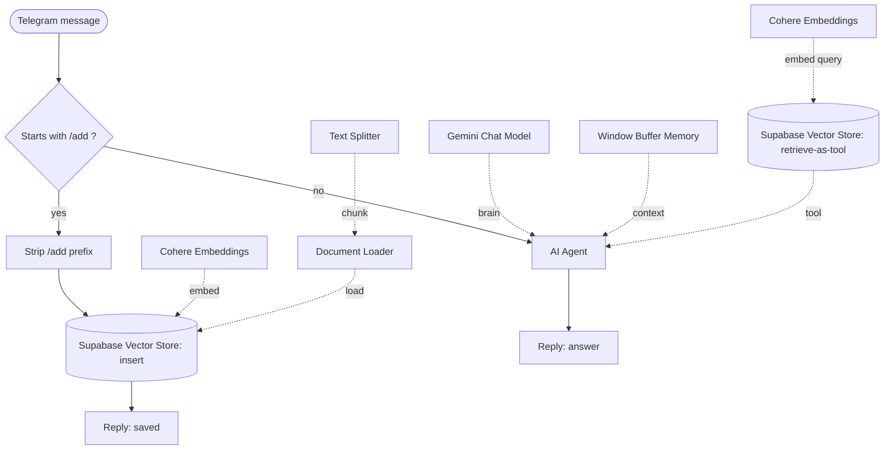

# Personal Knowledge Base Assistant （我的個人資料庫）

A personal knowledge base you talk to through Telegram. Send a note to save it; ask a
question and the bot retrieves your relevant notes and answers from them — a complete
**RAG (Retrieval-Augmented Generation)** pipeline built as a single [n8n](https://n8n.io)
workflow.

> Send `/add buy milk on Friday` to store a note.
> Later ask `what do I need to buy?` and it answers from your saved notes.

---

## Features

- **Chat-based capture & recall** — one Telegram bot handles both saving notes and answering questions.
- **Semantic search** — notes are embedded into vectors, so retrieval works by *meaning*, not just keywords.
- **Grounded answers** — the LLM only answers from retrieved notes and says so when nothing relevant is found.
- **Per-chat memory** — each Telegram conversation keeps its own short-term context.
- **Runs on free tiers** — Google Gemini (LLM), Cohere (embeddings), Supabase (vector DB).

---

## Architecture

**Two paths, one bot.** A message is routed by whether it begins with `/add`:

- **Ingest path** — the note text is split into chunks, each chunk is embedded with Cohere,
  and the vectors + original text are written to Supabase.
- **Query path** — an AI agent (Gemini) decides to call the retrieval tool, which embeds the
  question and pulls the most similar note chunks from Supabase, then the agent answers from them.

The same embedding model is used on both paths so the vectors live in the same 1024-dimensional space.

---

## Tech stack

| Layer | Choice |
|-------|--------|
| Orchestration | n8n (low-code workflow automation) |
| Interface | Telegram Bot |
| LLM | Google Gemini (`gemini-3.1-flash-lite`) |
| Embeddings | Cohere `embed-multilingual-v3.0` (1024-dim) |
| Vector database | Supabase (PostgreSQL + pgvector) |
| Pattern | Retrieval-Augmented Generation (RAG) + tool-calling agent |

---

## Setup

1. **Import the workflow** — in n8n, *Import from File* → `workflow.json`.
2. **Set up Supabase** — run `supabase_setup.sql` in the Supabase SQL Editor. It enables
   pgvector, creates the `documents` table (1024-dim), and the `match_documents` search function.
3. **Add credentials in n8n** (see `.env.example` for what you need): Telegram bot token,
   Google Gemini key, Cohere key, and Supabase URL + service-role key. Attach each credential
   to the matching node.
4. **Activate** the workflow. The Telegram trigger registers its webhook automatically.

> ⚠️ Credentials are entered in n8n, never committed to this repo. Keep your Supabase
> service-role key private — it bypasses row-level security.

---

## Usage

| Action | Send in Telegram |
|--------|------------------|
| Save a note | `/add your note here` |
| Ask a question | `your question` (no prefix) |

---

## Notes & learnings

- **Anthropic has no embeddings API**, so the LLM (Gemini) and the embedding model (Cohere)
  come from different providers — a common, intentional split in RAG systems.
- **Embedding dimension must match** between insert and query, and the Supabase table/function
  must declare the same dimension.
- The `match_documents` function qualifies every column with the table name to avoid
  PostgreSQL's "column reference is ambiguous" error.
- Inside the agent, the Telegram chat id is referenced with `.first()` rather than `.item`
  so it still resolves after the agent pauses to call a tool.
